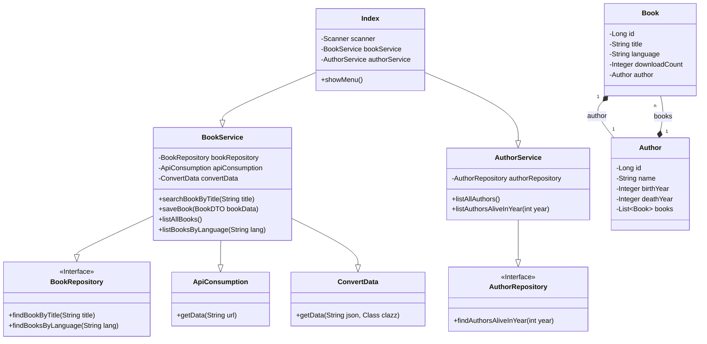

# Catálogo de Livros - Challenge Alura & Oracle ONE G9

Este projeto é um catálogo de livros interativo que funciona via console. Foi desenvolvido como parte do Challenge de Java da Alura em parceria com o programa Oracle Next Education (ONE). A aplicação permite aos usuários buscar livros através da API pública [Gutendex](https://gutendex.com/), salvar os livros e autores em um banco de dados local, e realizar diversas consultas sobre os dados armazenados.

## 🚀 Tecnologias Utilizadas

Este projeto foi construído com um conjunto de tecnologias modernas e robustas do ecossistema Java:

- **Java 17:** Versão da linguagem Java utilizada.
- **Spring Boot 3.5.8:** Framework principal para a criação da aplicação, facilitando a configuração, o desenvolvimento e a execução.
- **Spring Data JPA:** Para persistência de dados e comunicação com o banco de dados de forma simplificada.
- **PostgreSQL:** Sistema de gerenciamento de banco de dados relacional utilizado para armazenar os livros e autores.
- **Hibernate:** Framework de mapeamento objeto-relacional (ORM) utilizado pelo Spring Data JPA.
- **Maven:** Ferramenta de automação de compilação e gerenciamento de dependências.
- **Jackson:** Biblioteca para conversão de objetos Java para JSON e vice-versa, utilizada para processar a resposta da API.
- **Docker:** Para containerização do banco de dados PostgreSQL, facilitando a configuração do ambiente de desenvolvimento.

## 🎓 Principais Aprendizados

O desenvolvimento deste projeto proporcionou uma valiosa experiência prática e o aprofundamento em conceitos essenciais de desenvolvimento de software:

- **Consumo de APIs Externas:** Aprender a realizar requisições HTTP para uma API externa, tratar as respostas (JSON) e desserializar os dados para objetos Java (POJOs).
- **Persistência de Dados com Spring Data JPA:** Utilizar repositórios para abstrair o acesso ao banco de dados, mapear entidades (JPA Entities) e gerenciar o ciclo de vida dos objetos.
- **Arquitetura em Camadas:** Estruturar a aplicação de forma organizada, separando as responsabilidades em `model` (camada de domínio), `repository` (camada de acesso a dados), `service` (camada de lógica de negócio) e `index` (camada de apresentação).
- **Relacionamentos em Banco de Dados:** Implementar e gerenciar relacionamentos entre entidades, como o relacionamento `One-to-Many` entre `Author` e `Book`.
- **Uso de DTOs (Data Transfer Objects):** Utilizar DTOs para transferir dados entre as camadas da aplicação de forma segura e eficiente, evitando a exposição das entidades do banco de dados.
- **Gerenciamento de Ambiente com Docker:** Utilizar o `docker-compose` para criar e gerenciar o ambiente do banco de dados, garantindo consistência e facilidade na configuração.
- **Desenvolvimento de uma Aplicação de Console:** Criar uma interface de usuário interativa no console, utilizando `System.out` e `Scanner`.

## 📂 Estrutura do Projeto

O projeto segue uma arquitetura em camadas para garantir a separação de responsabilidades e a manutenibilidade do código:

```
/src/main/java/com/AluraOracleOneG9/Books
├── BooksApplication.java   // Classe principal que inicia a aplicação Spring Boot
├── DTO/                    // Data Transfer Objects para transferência de dados
│   └── BookDTO.java
├── index/                  // Camada de apresentação (interface de console)
│   └── Index.java
├── model/                  // Entidades do banco de dados (JPA)
│   ├── Author.java
│   └── Book.java
├── repository/             // Interfaces do Spring Data JPA para acesso ao banco
│   ├── AuthorRepository.java
│   └── BookRepository.java
└── service/                // Camada de lógica de negócio
    ├── ApiConsumption.java // Lida com a chamada à API Gutendex
    ├── AuthorService.java  // Lógica relacionada aos autores
    ├── BookService.java    // Lógica relacionada aos livros
    └── ConvertData.java    // Converte os dados da API (JSON) para objetos
```

## 📊 Diagrama de Classes

O diagrama abaixo representa as principais classes e seus relacionamentos dentro do sistema.



## ▶️ Como Executar o Projeto

Para executar o projeto em seu ambiente local, siga os passos abaixo.

### Pré-requisitos

- [Java 17](https://www.oracle.com/java/technologies/downloads/#java17) ou superior.
- [Maven 3.8](https://maven.apache.org/download.cgi) ou superior.
- [Docker](https://www.docker.com/products/docker-desktop/) e Docker Compose.

### Passos

1.  **Clone o Repositório:**
    ```bash
    git clone https://github.com/seu-usuario/seu-repositorio.git
    cd seu-repositorio
    ```

2.  **Inicie o Banco de Dados com Docker:**
    Na raiz do projeto, execute o comando para iniciar o container do PostgreSQL:
    ```bash
    docker-compose up -d
    ```
    Isso irá criar e iniciar um banco de dados PostgreSQL com as credenciais e o nome do banco definidos no arquivo `docker-compose.yaml`, que são as mesmas do arquivo `application.properties`.

3.  **Execute a Aplicação com Maven:**
    Ainda na raiz do projeto, execute o seguinte comando para compilar e iniciar a aplicação Spring Boot:
    ```bash
    mvn spring-boot:run
    ```

4.  **Interaja com o Catálogo:**
    Após a inicialização, o menu interativo será exibido no console, e você poderá começar a usar as funcionalidades do catálogo de livros.

## ✨ Funcionalidades

A aplicação oferece um menu interativo com 7 funcionalidades principais para explorar o catálogo de livros:

-   🔎 **1. Buscar Livro por Título:** Pesquisa por um livro na API Gutendex, exibe o resultado e salva o livro e seu autor no banco de dados para consultas futuras.
-   📚 **2. Listar Todos os Livros Registrados:** Mostra a lista completa de todos os livros que já foram salvos no banco de dados local.
-   📖 **3. Listar Livros Registrados por Título:** Permite buscar e exibir um livro específico que já está salvo no banco de dados pelo seu título.
-   ✒️ **4. Listar Todos os Autores Registrados:** Exibe uma lista com todos os autores que foram salvos no banco de dados.
-   👤 **5. Listar Autores Registrados por Nome:** Busca por um autor específico no banco de dados pelo nome e exibe seus dados.
-   🗓️ **6. Listar Autores Vivos em Determinado Ano:** Permite ao usuário inserir um ano e retorna uma lista de autores registrados que estavam vivos naquele período.
-   🗣️ **7. Listar Livros por Idioma:** Filtra e apresenta os livros salvos no banco de dados com base em um idioma específico (ex: `pt`, `en`, `es`, `fr`).
-   🚪 **0. Sair:** Encerra a aplicação.

---
Criado como parte do Challenge Alura.
